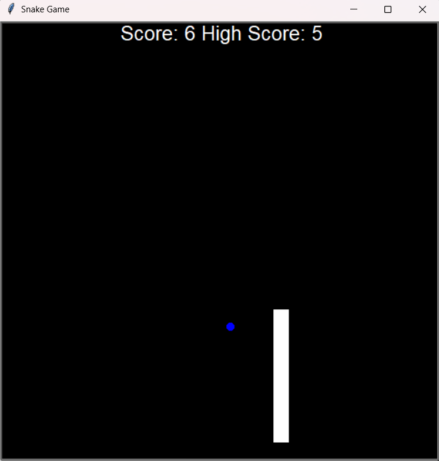

# 🐍 Snake Game
A classic Snake Game built using Python's turtle graphics module. The player controls a snake that grows longer by eating food, while avoiding collisions with walls and itself.

## 🎯 Features  
- Smooth snake movement with arrow key controls  
- Food spawns at random locations  
- Score tracking with high score saved in a file  
- Game resets after collision with wall or tail  
- Simple and fun gameplay

## 🛠️ Tech Stack
- Language: Python
- Library: turtle (for graphics)

## 📂 Project Structure
main.py           # Game loop and main logic
snake.py          # Snake class and movement
food.py           # Food class and random placement
scoreboard.py     # Score tracking and display
data.txt          # High score storage

## ▶️ How to Run
- Clone this repository:
git clone https://github.com/YourUsername/Snake-Game.git
- Navigate into the folder:
cd Snake-Game
- Run the game:
python main.py

## 🎮 Controls
⬆ Up Arrow → Move Up
⬇ Down Arrow → Move Down
⬅ Left Arrow → Move Left
➡ Right Arrow → Move Right

## 📸 Screenshot

## 💡 Future Improvements
- Add multiple difficulty levels
- Add sound effects
- Add obstacles
